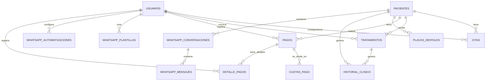

# 🗄️ DOCUMENTACIÓN DE BASE DE DATOS - DENTALSYNC

**Documento:** Especificación Completa de Base de Datos  
**Sistema:** DentalSync - Gestión para Consultorio Odontológico  
**Equipo:** NullDevs  
**Fecha:** 6 de octubre de 2025  
**Versión:** 1.0  
**Motor:** MariaDB 10.6+

---

## 📚 ÍNDICE

1. [Información General](#información-general)
2. [Diagrama de Entidad-Relación](#diagrama-de-entidad-relación)
3. [Tablas del Sistema](#tablas-del-sistema)
4. [Restricciones e Integridad](#restricciones-e-integridad)
5. [Scripts SQL DDL](#scripts-sql-ddl)
6. [Scripts SQL DML](#scripts-sql-dml)
7. [Índices y Optimización](#índices-y-optimización)
8. [Procedimientos y Funciones](#procedimientos-y-funciones)
9. [Triggers de Auditoría](#triggers-de-auditoría)
10. [Backup y Mantenimiento](#backup-y-mantenimiento)

---

## 📋 INFORMACIÓN GENERAL

### **Configuración de Base de Datos**
- **Motor:** MariaDB 10.6+
- **Charset:** UTF8MB4 (soporte Unicode completo)
- **Collation:** utf8mb4_unicode_ci
- **Motor de Almacenamiento:** InnoDB
- **Nombre de Base de Datos:** `dentalsync2`

### **Estadísticas del Sistema:**
- **Total de Tablas:** 16
- **Tablas Principales:** 9
- **Tablas de Sistema:** 5
- **Tablas WhatsApp:** 5
- **Total de Índices:** 45+
- **Restricciones FK:** 18
- **Triggers:** 8

---

## 🔗 DIAGRAMA DE ENTIDAD-RELACIÓN



---

## 📊 TABLAS DEL SISTEMA

### **🔵 TABLAS PRINCIPALES DE NEGOCIO**

#### **1. USUARIOS**
```sql
CREATE TABLE usuarios (
    id BIGINT UNSIGNED AUTO_INCREMENT PRIMARY KEY,
    usuario VARCHAR(100) UNIQUE NOT NULL,
    nombre VARCHAR(255) NOT NULL,
    rol ENUM('dentista', 'recepcionista') NOT NULL,
    password_hash VARCHAR(255) NOT NULL,
    activo BOOLEAN DEFAULT TRUE,
    ultimo_acceso DATETIME NULL,
    intentos_fallidos INT DEFAULT 0,
    bloqueado_hasta DATETIME NULL,
    created_at TIMESTAMP DEFAULT CURRENT_TIMESTAMP,
    updated_at TIMESTAMP DEFAULT CURRENT_TIMESTAMP ON UPDATE CURRENT_TIMESTAMP
);
```

#### **2. PACIENTES**
```sql
CREATE TABLE pacientes (
    id BIGINT UNSIGNED AUTO_INCREMENT PRIMARY KEY,
    nombre_completo VARCHAR(255) NOT NULL,
    telefono VARCHAR(20) NULL,
    fecha_nacimiento DATE NULL,
    email VARCHAR(255) NULL,
    direccion TEXT NULL,
    ciudad VARCHAR(100) NULL,
    alergias TEXT NULL,
    observaciones TEXT NULL,
    motivo_consulta TEXT NULL,
    contacto_emergencia VARCHAR(255) NULL,
    fecha_registro DATE NOT NULL,
    ultima_visita DATE NULL,
    created_at TIMESTAMP DEFAULT CURRENT_TIMESTAMP,
    updated_at TIMESTAMP DEFAULT CURRENT_TIMESTAMP ON UPDATE CURRENT_TIMESTAMP
);
```

#### **3. CITAS**
```sql
CREATE TABLE citas (
    id BIGINT UNSIGNED AUTO_INCREMENT PRIMARY KEY,
    fecha DATETIME NOT NULL,
    motivo TEXT NOT NULL,
    estado ENUM('pendiente', 'confirmada', 'cancelada', 'atendida') DEFAULT 'pendiente',
    fecha_atendida DATETIME NULL,
    paciente_id BIGINT UNSIGNED NOT NULL,
    usuario_id BIGINT UNSIGNED NOT NULL,
    created_at TIMESTAMP DEFAULT CURRENT_TIMESTAMP,
    updated_at TIMESTAMP DEFAULT CURRENT_TIMESTAMP ON UPDATE CURRENT_TIMESTAMP,
    
    FOREIGN KEY (paciente_id) REFERENCES pacientes(id) ON DELETE CASCADE,
    FOREIGN KEY (usuario_id) REFERENCES usuarios(id) ON DELETE CASCADE
);
```

#### **4. TRATAMIENTOS**
```sql
CREATE TABLE tratamientos (
    id BIGINT UNSIGNED AUTO_INCREMENT PRIMARY KEY,
    descripcion TEXT NOT NULL,
    fecha_inicio DATE NOT NULL,
    fecha_fin DATE NULL,
    estado ENUM('activo', 'finalizado') DEFAULT 'activo',
    costo_estimado DECIMAL(10,2) NULL,
    observaciones_finales TEXT NULL,
    paciente_id BIGINT UNSIGNED NOT NULL,
    usuario_id BIGINT UNSIGNED NOT NULL,
    created_at TIMESTAMP DEFAULT CURRENT_TIMESTAMP,
    updated_at TIMESTAMP DEFAULT CURRENT_TIMESTAMP ON UPDATE CURRENT_TIMESTAMP,
    
    FOREIGN KEY (paciente_id) REFERENCES pacientes(id) ON DELETE CASCADE,
    FOREIGN KEY (usuario_id) REFERENCES usuarios(id) ON DELETE CASCADE
);
```

#### **5. HISTORIAL_CLINICO**
```sql
CREATE TABLE historial_clinico (
    id BIGINT UNSIGNED AUTO_INCREMENT PRIMARY KEY,
    fecha DATE NOT NULL,
    descripcion TEXT NOT NULL,
    tipo_entrada ENUM('consulta', 'tratamiento', 'observacion', 'diagnostico') DEFAULT 'observacion',
    paciente_id BIGINT UNSIGNED NOT NULL,
    tratamiento_id BIGINT UNSIGNED NULL,
    usuario_id BIGINT UNSIGNED NOT NULL,
    created_at TIMESTAMP DEFAULT CURRENT_TIMESTAMP,
    updated_at TIMESTAMP DEFAULT CURRENT_TIMESTAMP ON UPDATE CURRENT_TIMESTAMP,
    
    FOREIGN KEY (paciente_id) REFERENCES pacientes(id) ON DELETE CASCADE,
    FOREIGN KEY (tratamiento_id) REFERENCES tratamientos(id) ON DELETE SET NULL,
    FOREIGN KEY (usuario_id) REFERENCES usuarios(id) ON DELETE CASCADE
);
```

#### **6. PAGOS**
```sql
CREATE TABLE pagos (
    id BIGINT UNSIGNED AUTO_INCREMENT PRIMARY KEY,
    fecha_pago DATE NOT NULL,
    monto_total DECIMAL(10,2) NOT NULL,
    monto_pagado DECIMAL(10,2) DEFAULT 0.00,
    saldo_restante DECIMAL(10,2) DEFAULT 0.00,
    descripcion TEXT NOT NULL,
    modalidad_pago ENUM('pago_unico', 'cuotas_fijas', 'cuotas_variables') DEFAULT 'pago_unico',
    total_cuotas INT NULL,
    estado_pago ENUM('pendiente', 'pagado_parcial', 'pagado_completo', 'vencido') DEFAULT 'pendiente',
    observaciones TEXT NULL,
    paciente_id BIGINT UNSIGNED NOT NULL,
    usuario_id BIGINT UNSIGNED NOT NULL,
    created_at TIMESTAMP DEFAULT CURRENT_TIMESTAMP,
    updated_at TIMESTAMP DEFAULT CURRENT_TIMESTAMP ON UPDATE CURRENT_TIMESTAMP,
    
    FOREIGN KEY (paciente_id) REFERENCES pacientes(id) ON DELETE CASCADE,
    FOREIGN KEY (usuario_id) REFERENCES usuarios(id) ON DELETE CASCADE
);
```

#### **7. CUOTAS_PAGO**
```sql
CREATE TABLE cuotas_pago (
    id BIGINT UNSIGNED AUTO_INCREMENT PRIMARY KEY,
    pago_id BIGINT UNSIGNED NOT NULL,
    numero_cuota INT NOT NULL,
    monto DECIMAL(10,2) NOT NULL,
    fecha_vencimiento DATE NOT NULL,
    fecha_pago DATE NULL,
    estado ENUM('pendiente', 'pagada', 'vencida') DEFAULT 'pendiente',
    created_at TIMESTAMP DEFAULT CURRENT_TIMESTAMP,
    updated_at TIMESTAMP DEFAULT CURRENT_TIMESTAMP ON UPDATE CURRENT_TIMESTAMP,
    
    FOREIGN KEY (pago_id) REFERENCES pagos(id) ON DELETE CASCADE
);
```

#### **8. DETALLE_PAGOS**
```sql
CREATE TABLE detalle_pagos (
    id BIGINT UNSIGNED AUTO_INCREMENT PRIMARY KEY,
    pago_id BIGINT UNSIGNED NOT NULL,
    fecha_pago DATE NOT NULL,
    monto_parcial DECIMAL(10,2) NOT NULL,
    descripcion TEXT NULL,
    tipo_pago ENUM('cuota_fija', 'pago_variable', 'pago_completo') DEFAULT 'pago_completo',
    numero_cuota INT NULL,
    metodo_pago ENUM('efectivo', 'tarjeta', 'transferencia', 'cheque') DEFAULT 'efectivo',
    comprobante_numero VARCHAR(100) NULL,
    usuario_id BIGINT UNSIGNED NOT NULL,
    created_at TIMESTAMP DEFAULT CURRENT_TIMESTAMP,
    updated_at TIMESTAMP DEFAULT CURRENT_TIMESTAMP ON UPDATE CURRENT_TIMESTAMP,
    
    FOREIGN KEY (pago_id) REFERENCES pagos(id) ON DELETE CASCADE,
    FOREIGN KEY (usuario_id) REFERENCES usuarios(id) ON DELETE CASCADE
);
```

#### **9. PLACAS_DENTALES**
```sql
CREATE TABLE placas_dentales (
    id BIGINT UNSIGNED AUTO_INCREMENT PRIMARY KEY,
    fecha DATE NOT NULL,
    lugar VARCHAR(255) NOT NULL,
    tipo ENUM('panoramica', 'periapical', 'bitewing', 'oclusal', 'lateral', 'frontal') NOT NULL,
    archivo_url VARCHAR(500) NULL,
    archivo_nombre VARCHAR(255) NULL,
    archivo_tamaño INT NULL,
    archivo_tipo VARCHAR(50) NULL,
    descripcion TEXT NULL,
    paciente_id BIGINT UNSIGNED NOT NULL,
    usuario_id BIGINT UNSIGNED NOT NULL,
    created_at TIMESTAMP DEFAULT CURRENT_TIMESTAMP,
    updated_at TIMESTAMP DEFAULT CURRENT_TIMESTAMP ON UPDATE CURRENT_TIMESTAMP,
    
    FOREIGN KEY (paciente_id) REFERENCES pacientes(id) ON DELETE CASCADE,
    FOREIGN KEY (usuario_id) REFERENCES usuarios(id) ON DELETE CASCADE
);
```

### **📱 TABLAS WHATSAPP**

#### **10. WHATSAPP_CONVERSACIONES**
```sql
CREATE TABLE whatsapp_conversaciones (
    id BIGINT UNSIGNED AUTO_INCREMENT PRIMARY KEY,
    paciente_id BIGINT UNSIGNED NOT NULL,
    telefono VARCHAR(20) NOT NULL,
    nombre_contacto VARCHAR(255) NOT NULL,
    estado ENUM('activa', 'pausada', 'cerrada', 'bloqueada') DEFAULT 'activa',
    ultimo_mensaje_fecha TIMESTAMP NULL,
    ultimo_mensaje_texto TEXT NULL,
    ultimo_mensaje_propio BOOLEAN DEFAULT FALSE,
    mensajes_no_leidos INT DEFAULT 0,
    metadata JSON NULL,
    created_at TIMESTAMP DEFAULT CURRENT_TIMESTAMP,
    updated_at TIMESTAMP DEFAULT CURRENT_TIMESTAMP ON UPDATE CURRENT_TIMESTAMP,
    
    FOREIGN KEY (paciente_id) REFERENCES pacientes(id) ON DELETE CASCADE,
    UNIQUE KEY unique_paciente_telefono (paciente_id, telefono)
);
```

#### **11. WHATSAPP_MENSAJES**
```sql
CREATE TABLE whatsapp_mensajes (
    id BIGINT UNSIGNED AUTO_INCREMENT PRIMARY KEY,
    conversacion_id BIGINT UNSIGNED NOT NULL,
    mensaje_whatsapp_id VARCHAR(255) NULL,
    contenido TEXT NOT NULL,
    es_propio BOOLEAN DEFAULT TRUE,
    estado ENUM('enviando', 'enviado', 'entregado', 'leido', 'error') DEFAULT 'enviando',
    tipo ENUM('texto', 'imagen', 'documento', 'audio', 'video') DEFAULT 'texto',
    metadata JSON NULL,
    fecha_envio TIMESTAMP NOT NULL,
    fecha_entregado TIMESTAMP NULL,
    fecha_leido TIMESTAMP NULL,
    error_mensaje TEXT NULL,
    created_at TIMESTAMP DEFAULT CURRENT_TIMESTAMP,
    updated_at TIMESTAMP DEFAULT CURRENT_TIMESTAMP ON UPDATE CURRENT_TIMESTAMP,
    
    FOREIGN KEY (conversacion_id) REFERENCES whatsapp_conversaciones(id) ON DELETE CASCADE
);
```

#### **12. WHATSAPP_PLANTILLAS**
```sql
CREATE TABLE whatsapp_plantillas (
    id BIGINT UNSIGNED AUTO_INCREMENT PRIMARY KEY,
    nombre VARCHAR(255) NOT NULL,
    descripcion TEXT NULL,
    categoria ENUM('recordatorio', 'confirmacion', 'pago', 'tratamiento', 'bienvenida', 'general') DEFAULT 'general',
    contenido TEXT NOT NULL,
    activa BOOLEAN DEFAULT TRUE,
    usos INT DEFAULT 0,
    variables_detectadas JSON NULL,
    etiquetas JSON NULL,
    creado_por BIGINT UNSIGNED NULL,
    created_at TIMESTAMP DEFAULT CURRENT_TIMESTAMP,
    updated_at TIMESTAMP DEFAULT CURRENT_TIMESTAMP ON UPDATE CURRENT_TIMESTAMP,
    
    FOREIGN KEY (creado_por) REFERENCES usuarios(id) ON DELETE SET NULL
);
```

#### **13. WHATSAPP_AUTOMATIZACIONES**
```sql
CREATE TABLE whatsapp_automatizaciones (
    id BIGINT UNSIGNED AUTO_INCREMENT PRIMARY KEY,
    nombre VARCHAR(255) NOT NULL,
    descripcion TEXT NULL,
    tipo ENUM('recordatorio', 'seguimiento', 'bienvenida', 'cumpleanos', 'pago') DEFAULT 'recordatorio',
    condicion JSON NOT NULL,
    audiencia ENUM('todos', 'nuevos', 'recurrentes', 'activos') DEFAULT 'todos',
    mensaje TEXT NOT NULL,
    plantilla_id BIGINT UNSIGNED NULL,
    estado ENUM('activa', 'inactiva', 'pausada') DEFAULT 'activa',
    limite_envios BOOLEAN DEFAULT FALSE,
    max_envios_paciente INT DEFAULT 1,
    ejecutada INT DEFAULT 0,
    exitosas INT DEFAULT 0,
    fallidas INT DEFAULT 0,
    ultimo_ejecutado TIMESTAMP NULL,
    creado_por BIGINT UNSIGNED NULL,
    created_at TIMESTAMP DEFAULT CURRENT_TIMESTAMP,
    updated_at TIMESTAMP DEFAULT CURRENT_TIMESTAMP ON UPDATE CURRENT_TIMESTAMP,
    
    FOREIGN KEY (plantilla_id) REFERENCES whatsapp_plantillas(id) ON DELETE SET NULL,
    FOREIGN KEY (creado_por) REFERENCES usuarios(id) ON DELETE SET NULL
);
```

#### **14. WHATSAPP_ENVIOS_PROGRAMADOS**
```sql
CREATE TABLE whatsapp_envios_programados (
    id BIGINT UNSIGNED AUTO_INCREMENT PRIMARY KEY,
    conversacion_id BIGINT UNSIGNED NOT NULL,
    plantilla_id BIGINT UNSIGNED NULL,
    automatizacion_id BIGINT UNSIGNED NULL,
    mensaje TEXT NOT NULL,
    fecha_programada DATETIME NOT NULL,
    estado ENUM('programado', 'enviado', 'error', 'cancelado') DEFAULT 'programado',
    intentos INT DEFAULT 0,
    max_intentos INT DEFAULT 3,
    error_mensaje TEXT NULL,
    fecha_enviado TIMESTAMP NULL,
    creado_por BIGINT UNSIGNED NULL,
    created_at TIMESTAMP DEFAULT CURRENT_TIMESTAMP,
    updated_at TIMESTAMP DEFAULT CURRENT_TIMESTAMP ON UPDATE CURRENT_TIMESTAMP,
    
    FOREIGN KEY (conversacion_id) REFERENCES whatsapp_conversaciones(id) ON DELETE CASCADE,
    FOREIGN KEY (plantilla_id) REFERENCES whatsapp_plantillas(id) ON DELETE SET NULL,
    FOREIGN KEY (automatizacion_id) REFERENCES whatsapp_automatizaciones(id) ON DELETE SET NULL,
    FOREIGN KEY (creado_por) REFERENCES usuarios(id) ON DELETE SET NULL
);
```

### **⚙️ TABLAS DE SISTEMA**

#### **15. SESSIONS**
```sql
CREATE TABLE sessions (
    id VARCHAR(40) PRIMARY KEY,
    user_id BIGINT UNSIGNED NULL,
    ip_address VARCHAR(45) NULL,
    user_agent TEXT NULL,
    payload LONGTEXT NOT NULL,
    last_activity INT NOT NULL,
    
    KEY sessions_user_id_index (user_id),
    KEY sessions_last_activity_index (last_activity)
);
```

#### **16. CACHE**
```sql
CREATE TABLE cache (
    `key` VARCHAR(255) PRIMARY KEY,
    value MEDIUMTEXT NOT NULL,
    expiration INT NOT NULL,
    
    KEY cache_expiration_index (expiration)
);

CREATE TABLE cache_locks (
    `key` VARCHAR(255) PRIMARY KEY,
    owner VARCHAR(255) NOT NULL,
    expiration INT NOT NULL
);
```

---

## 🔒 RESTRICCIONES E INTEGRIDAD

### **Restricciones de Clave Primaria**
```sql
-- Todas las tablas tienen PK AUTO_INCREMENT
ALTER TABLE usuarios ADD CONSTRAINT pk_usuarios PRIMARY KEY (id);
ALTER TABLE pacientes ADD CONSTRAINT pk_pacientes PRIMARY KEY (id);
ALTER TABLE citas ADD CONSTRAINT pk_citas PRIMARY KEY (id);
ALTER TABLE tratamientos ADD CONSTRAINT pk_tratamientos PRIMARY KEY (id);
ALTER TABLE historial_clinico ADD CONSTRAINT pk_historial_clinico PRIMARY KEY (id);
ALTER TABLE pagos ADD CONSTRAINT pk_pagos PRIMARY KEY (id);
ALTER TABLE cuotas_pago ADD CONSTRAINT pk_cuotas_pago PRIMARY KEY (id);
ALTER TABLE detalle_pagos ADD CONSTRAINT pk_detalle_pagos PRIMARY KEY (id);
ALTER TABLE placas_dentales ADD CONSTRAINT pk_placas_dentales PRIMARY KEY (id);
```

### **Restricciones de Clave Foránea**
```sql
-- Citas
ALTER TABLE citas ADD CONSTRAINT fk_citas_paciente 
    FOREIGN KEY (paciente_id) REFERENCES pacientes(id) ON DELETE CASCADE;
ALTER TABLE citas ADD CONSTRAINT fk_citas_usuario 
    FOREIGN KEY (usuario_id) REFERENCES usuarios(id) ON DELETE CASCADE;

-- Tratamientos
ALTER TABLE tratamientos ADD CONSTRAINT fk_tratamientos_paciente 
    FOREIGN KEY (paciente_id) REFERENCES pacientes(id) ON DELETE CASCADE;
ALTER TABLE tratamientos ADD CONSTRAINT fk_tratamientos_usuario 
    FOREIGN KEY (usuario_id) REFERENCES usuarios(id) ON DELETE CASCADE;

-- Historial Clínico
ALTER TABLE historial_clinico ADD CONSTRAINT fk_historial_paciente 
    FOREIGN KEY (paciente_id) REFERENCES pacientes(id) ON DELETE CASCADE;
ALTER TABLE historial_clinico ADD CONSTRAINT fk_historial_tratamiento 
    FOREIGN KEY (tratamiento_id) REFERENCES tratamientos(id) ON DELETE SET NULL;
ALTER TABLE historial_clinico ADD CONSTRAINT fk_historial_usuario 
    FOREIGN KEY (usuario_id) REFERENCES usuarios(id) ON DELETE CASCADE;

-- Pagos
ALTER TABLE pagos ADD CONSTRAINT fk_pagos_paciente 
    FOREIGN KEY (paciente_id) REFERENCES pacientes(id) ON DELETE CASCADE;
ALTER TABLE pagos ADD CONSTRAINT fk_pagos_usuario 
    FOREIGN KEY (usuario_id) REFERENCES usuarios(id) ON DELETE CASCADE;

-- Cuotas de Pago
ALTER TABLE cuotas_pago ADD CONSTRAINT fk_cuotas_pago 
    FOREIGN KEY (pago_id) REFERENCES pagos(id) ON DELETE CASCADE;

-- Detalle de Pagos
ALTER TABLE detalle_pagos ADD CONSTRAINT fk_detalle_pago 
    FOREIGN KEY (pago_id) REFERENCES pagos(id) ON DELETE CASCADE;
ALTER TABLE detalle_pagos ADD CONSTRAINT fk_detalle_usuario 
    FOREIGN KEY (usuario_id) REFERENCES usuarios(id) ON DELETE CASCADE;

-- Placas Dentales
ALTER TABLE placas_dentales ADD CONSTRAINT fk_placas_paciente 
    FOREIGN KEY (paciente_id) REFERENCES pacientes(id) ON DELETE CASCADE;
ALTER TABLE placas_dentales ADD CONSTRAINT fk_placas_usuario 
    FOREIGN KEY (usuario_id) REFERENCES usuarios(id) ON DELETE CASCADE;

-- WhatsApp
ALTER TABLE whatsapp_conversaciones ADD CONSTRAINT fk_conversaciones_paciente 
    FOREIGN KEY (paciente_id) REFERENCES pacientes(id) ON DELETE CASCADE;
ALTER TABLE whatsapp_mensajes ADD CONSTRAINT fk_mensajes_conversacion 
    FOREIGN KEY (conversacion_id) REFERENCES whatsapp_conversaciones(id) ON DELETE CASCADE;
ALTER TABLE whatsapp_plantillas ADD CONSTRAINT fk_plantillas_usuario 
    FOREIGN KEY (creado_por) REFERENCES usuarios(id) ON DELETE SET NULL;
ALTER TABLE whatsapp_automatizaciones ADD CONSTRAINT fk_automatizaciones_usuario 
    FOREIGN KEY (creado_por) REFERENCES usuarios(id) ON DELETE SET NULL;
```

### **Restricciones de Unicidad**
```sql
-- Usuarios únicos
ALTER TABLE usuarios ADD CONSTRAINT unique_usuario UNIQUE (usuario);

-- Un paciente-teléfono único por conversación WhatsApp
ALTER TABLE whatsapp_conversaciones ADD CONSTRAINT unique_paciente_telefono 
    UNIQUE (paciente_id, telefono);

-- Nombres de plantillas únicos
ALTER TABLE whatsapp_plantillas ADD CONSTRAINT unique_nombre_plantilla 
    UNIQUE (nombre);
```

### **Restricciones CHECK**
```sql
-- Validaciones de montos (siempre positivos)
ALTER TABLE pagos ADD CONSTRAINT check_monto_total_positivo 
    CHECK (monto_total > 0);
ALTER TABLE pagos ADD CONSTRAINT check_monto_pagado_no_negativo 
    CHECK (monto_pagado >= 0);
ALTER TABLE pagos ADD CONSTRAINT check_saldo_no_negativo 
    CHECK (saldo_restante >= 0);

ALTER TABLE cuotas_pago ADD CONSTRAINT check_monto_cuota_positivo 
    CHECK (monto > 0);
ALTER TABLE detalle_pagos ADD CONSTRAINT check_monto_parcial_positivo 
    CHECK (monto_parcial > 0);

-- Validaciones de fechas
ALTER TABLE pacientes ADD CONSTRAINT check_fecha_nacimiento_valida 
    CHECK (fecha_nacimiento <= CURDATE());
ALTER TABLE tratamientos ADD CONSTRAINT check_fechas_tratamiento 
    CHECK (fecha_fin IS NULL OR fecha_fin >= fecha_inicio);

-- Validaciones de cuotas
ALTER TABLE pagos ADD CONSTRAINT check_total_cuotas_valido 
    CHECK (total_cuotas IS NULL OR total_cuotas > 0);
ALTER TABLE cuotas_pago ADD CONSTRAINT check_numero_cuota_positivo 
    CHECK (numero_cuota > 0);

-- Validaciones de WhatsApp
ALTER TABLE whatsapp_conversaciones ADD CONSTRAINT check_mensajes_no_leidos 
    CHECK (mensajes_no_leidos >= 0);
ALTER TABLE whatsapp_automatizaciones ADD CONSTRAINT check_max_envios_positivo 
    CHECK (max_envios_paciente > 0);
ALTER TABLE whatsapp_automatizaciones ADD CONSTRAINT check_contadores_no_negativos 
    CHECK (ejecutada >= 0 AND exitosas >= 0 AND fallidas >= 0);
```

---

## 💾 SCRIPTS SQL DDL

### **Script de Creación Completo**
```sql
-- ============================================================================
-- SCRIPT DDL COMPLETO - DENTALSYNC
-- ============================================================================
-- Fecha: 2025-10-06
-- Versión: 2.0
-- Motor: MariaDB 10.6+
-- ============================================================================

-- Configuración inicial
SET @OLD_UNIQUE_CHECKS=@@UNIQUE_CHECKS, UNIQUE_CHECKS=0;
SET @OLD_FOREIGN_KEY_CHECKS=@@FOREIGN_KEY_CHECKS, FOREIGN_KEY_CHECKS=0;
SET @OLD_SQL_MODE=@@SQL_MODE, SQL_MODE='ONLY_FULL_GROUP_BY,STRICT_TRANS_TABLES,NO_ZERO_IN_DATE,NO_ZERO_DATE,ERROR_FOR_DIVISION_BY_ZERO,NO_AUTO_CREATE_USER,NO_ENGINE_SUBSTITUTION';

-- Crear base de datos
CREATE DATABASE IF NOT EXISTS dentalsync2 
CHARACTER SET utf8mb4 
COLLATE utf8mb4_unicode_ci;

USE dentalsync2;

-- ============================================================================
-- 1. TABLA USUARIOS
-- ============================================================================
CREATE TABLE usuarios (
    id BIGINT UNSIGNED AUTO_INCREMENT PRIMARY KEY,
    usuario VARCHAR(100) NOT NULL,
    nombre VARCHAR(255) NOT NULL,
    rol ENUM('dentista', 'recepcionista') NOT NULL,
    password_hash VARCHAR(255) NOT NULL,
    activo BOOLEAN DEFAULT TRUE,
    ultimo_acceso DATETIME NULL,
    intentos_fallidos INT DEFAULT 0,
    bloqueado_hasta DATETIME NULL,
    created_at TIMESTAMP DEFAULT CURRENT_TIMESTAMP,
    updated_at TIMESTAMP DEFAULT CURRENT_TIMESTAMP ON UPDATE CURRENT_TIMESTAMP,
    
    UNIQUE KEY unique_usuario (usuario),
    INDEX idx_usuarios_rol (rol),
    INDEX idx_usuarios_activo (activo),
    INDEX idx_usuarios_ultimo_acceso (ultimo_acceso)
) ENGINE=InnoDB DEFAULT CHARSET=utf8mb4 COLLATE=utf8mb4_unicode_ci;

-- ============================================================================
-- 2. TABLA PACIENTES
-- ============================================================================
CREATE TABLE pacientes (
    id BIGINT UNSIGNED AUTO_INCREMENT PRIMARY KEY,
    nombre_completo VARCHAR(255) NOT NULL,
    telefono VARCHAR(20) NULL,
    fecha_nacimiento DATE NULL,
    email VARCHAR(255) NULL,
    direccion TEXT NULL,
    ciudad VARCHAR(100) NULL,
    alergias TEXT NULL,
    observaciones TEXT NULL,
    motivo_consulta TEXT NULL,
    contacto_emergencia VARCHAR(255) NULL,
    fecha_registro DATE NOT NULL,
    ultima_visita DATE NULL,
    created_at TIMESTAMP DEFAULT CURRENT_TIMESTAMP,
    updated_at TIMESTAMP DEFAULT CURRENT_TIMESTAMP ON UPDATE CURRENT_TIMESTAMP,
    
    INDEX idx_pacientes_nombre (nombre_completo),
    INDEX idx_pacientes_telefono (telefono),
    INDEX idx_pacientes_fecha_nacimiento (fecha_nacimiento),
    INDEX idx_pacientes_ultima_visita (ultima_visita),
    FULLTEXT KEY ft_pacientes_busqueda (nombre_completo, telefono, email)
) ENGINE=InnoDB DEFAULT CHARSET=utf8mb4 COLLATE=utf8mb4_unicode_ci;

-- ============================================================================
-- 3. TABLA CITAS
-- ============================================================================
CREATE TABLE citas (
    id BIGINT UNSIGNED AUTO_INCREMENT PRIMARY KEY,
    fecha DATETIME NOT NULL,
    motivo TEXT NOT NULL,
    estado ENUM('pendiente', 'confirmada', 'cancelada', 'atendida') DEFAULT 'pendiente',
    fecha_atendida DATETIME NULL,
    paciente_id BIGINT UNSIGNED NOT NULL,
    usuario_id BIGINT UNSIGNED NOT NULL,
    created_at TIMESTAMP DEFAULT CURRENT_TIMESTAMP,
    updated_at TIMESTAMP DEFAULT CURRENT_TIMESTAMP ON UPDATE CURRENT_TIMESTAMP,
    
    INDEX idx_citas_fecha (fecha),
    INDEX idx_citas_estado (estado),
    INDEX idx_citas_paciente (paciente_id),
    INDEX idx_citas_usuario (usuario_id),
    INDEX idx_citas_fecha_estado (fecha, estado),
    
    FOREIGN KEY fk_citas_paciente (paciente_id) REFERENCES pacientes(id) ON DELETE CASCADE,
    FOREIGN KEY fk_citas_usuario (usuario_id) REFERENCES usuarios(id) ON DELETE CASCADE
) ENGINE=InnoDB DEFAULT CHARSET=utf8mb4 COLLATE=utf8mb4_unicode_ci;

-- ============================================================================
-- 4. TABLA TRATAMIENTOS
-- ============================================================================
CREATE TABLE tratamientos (
    id BIGINT UNSIGNED AUTO_INCREMENT PRIMARY KEY,
    descripcion TEXT NOT NULL,
    fecha_inicio DATE NOT NULL,
    fecha_fin DATE NULL,
    estado ENUM('activo', 'finalizado') DEFAULT 'activo',
    costo_estimado DECIMAL(10,2) NULL,
    observaciones_finales TEXT NULL,
    paciente_id BIGINT UNSIGNED NOT NULL,
    usuario_id BIGINT UNSIGNED NOT NULL,
    created_at TIMESTAMP DEFAULT CURRENT_TIMESTAMP,
    updated_at TIMESTAMP DEFAULT CURRENT_TIMESTAMP ON UPDATE CURRENT_TIMESTAMP,
    
    INDEX idx_tratamientos_fecha_inicio (fecha_inicio),
    INDEX idx_tratamientos_estado (estado),
    INDEX idx_tratamientos_paciente (paciente_id),
    INDEX idx_tratamientos_usuario (usuario_id),
    INDEX idx_tratamientos_paciente_estado (paciente_id, estado),
    
    FOREIGN KEY fk_tratamientos_paciente (paciente_id) REFERENCES pacientes(id) ON DELETE CASCADE,
    FOREIGN KEY fk_tratamientos_usuario (usuario_id) REFERENCES usuarios(id) ON DELETE CASCADE
) ENGINE=InnoDB DEFAULT CHARSET=utf8mb4 COLLATE=utf8mb4_unicode_ci;

-- ============================================================================
-- 5. TABLA HISTORIAL_CLINICO
-- ============================================================================
CREATE TABLE historial_clinico (
    id BIGINT UNSIGNED AUTO_INCREMENT PRIMARY KEY,
    fecha DATE NOT NULL,
    descripcion TEXT NOT NULL,
    tipo_entrada ENUM('consulta', 'tratamiento', 'observacion', 'diagnostico') DEFAULT 'observacion',
    paciente_id BIGINT UNSIGNED NOT NULL,
    tratamiento_id BIGINT UNSIGNED NULL,
    usuario_id BIGINT UNSIGNED NOT NULL,
    created_at TIMESTAMP DEFAULT CURRENT_TIMESTAMP,
    updated_at TIMESTAMP DEFAULT CURRENT_TIMESTAMP ON UPDATE CURRENT_TIMESTAMP,
    
    INDEX idx_historial_fecha (fecha),
    INDEX idx_historial_paciente (paciente_id),
    INDEX idx_historial_tratamiento (tratamiento_id),
    INDEX idx_historial_usuario (usuario_id),
    INDEX idx_historial_tipo (tipo_entrada),
    INDEX idx_historial_paciente_fecha (paciente_id, fecha DESC),
    
    FOREIGN KEY fk_historial_paciente (paciente_id) REFERENCES pacientes(id) ON DELETE CASCADE,
    FOREIGN KEY fk_historial_tratamiento (tratamiento_id) REFERENCES tratamientos(id) ON DELETE SET NULL,
    FOREIGN KEY fk_historial_usuario (usuario_id) REFERENCES usuarios(id) ON DELETE CASCADE
) ENGINE=InnoDB DEFAULT CHARSET=utf8mb4 COLLATE=utf8mb4_unicode_ci;

-- ============================================================================
-- 6. TABLA PAGOS
-- ============================================================================
CREATE TABLE pagos (
    id BIGINT UNSIGNED AUTO_INCREMENT PRIMARY KEY,
    fecha_pago DATE NOT NULL,
    monto_total DECIMAL(10,2) NOT NULL,
    monto_pagado DECIMAL(10,2) DEFAULT 0.00,
    saldo_restante DECIMAL(10,2) DEFAULT 0.00,
    descripcion TEXT NOT NULL,
    modalidad_pago ENUM('pago_unico', 'cuotas_fijas', 'cuotas_variables') DEFAULT 'pago_unico',
    total_cuotas INT NULL,
    estado_pago ENUM('pendiente', 'pagado_parcial', 'pagado_completo', 'vencido') DEFAULT 'pendiente',
    observaciones TEXT NULL,
    paciente_id BIGINT UNSIGNED NOT NULL,
    usuario_id BIGINT UNSIGNED NOT NULL,
    created_at TIMESTAMP DEFAULT CURRENT_TIMESTAMP,
    updated_at TIMESTAMP DEFAULT CURRENT_TIMESTAMP ON UPDATE CURRENT_TIMESTAMP,
    
    INDEX idx_pagos_fecha (fecha_pago),
    INDEX idx_pagos_modalidad (modalidad_pago),
    INDEX idx_pagos_estado (estado_pago),
    INDEX idx_pagos_paciente (paciente_id),
    INDEX idx_pagos_usuario (usuario_id),
    INDEX idx_pagos_paciente_estado (paciente_id, estado_pago),
    
    FOREIGN KEY fk_pagos_paciente (paciente_id) REFERENCES pacientes(id) ON DELETE CASCADE,
    FOREIGN KEY fk_pagos_usuario (usuario_id) REFERENCES usuarios(id) ON DELETE CASCADE,
    
    CONSTRAINT check_monto_total_positivo CHECK (monto_total > 0),
    CONSTRAINT check_monto_pagado_no_negativo CHECK (monto_pagado >= 0),
    CONSTRAINT check_saldo_no_negativo CHECK (saldo_restante >= 0),
    CONSTRAINT check_total_cuotas_valido CHECK (total_cuotas IS NULL OR total_cuotas > 0)
) ENGINE=InnoDB DEFAULT CHARSET=utf8mb4 COLLATE=utf8mb4_unicode_ci;
```

### **Script de Índices de Optimización**
```sql
-- ============================================================================
-- ÍNDICES DE OPTIMIZACIÓN
-- ============================================================================

-- Índices compuestos para consultas frecuentes
CREATE INDEX idx_citas_usuario_fecha ON citas(usuario_id, fecha);
CREATE INDEX idx_citas_paciente_fecha ON citas(paciente_id, fecha DESC);
CREATE INDEX idx_tratamientos_usuario_estado ON tratamientos(usuario_id, estado);
CREATE INDEX idx_pagos_fecha_estado ON pagos(fecha_pago, estado_pago);
CREATE INDEX idx_cuotas_vencimiento_estado ON cuotas_pago(fecha_vencimiento, estado);

-- Índices para búsquedas de texto
CREATE FULLTEXT INDEX ft_pacientes_busqueda ON pacientes(nombre_completo, telefono);
CREATE FULLTEXT INDEX ft_tratamientos_descripcion ON tratamientos(descripcion);
CREATE FULLTEXT INDEX ft_historial_descripcion ON historial_clinico(descripcion);

-- Índices para WhatsApp
CREATE INDEX idx_conversaciones_estado_fecha ON whatsapp_conversaciones(estado, ultimo_mensaje_fecha DESC);
CREATE INDEX idx_mensajes_conversacion_fecha ON whatsapp_mensajes(conversacion_id, fecha_envio DESC);
CREATE INDEX idx_mensajes_estado_tipo ON whatsapp_mensajes(estado, tipo);
CREATE INDEX idx_plantillas_categoria_activa ON whatsapp_plantillas(categoria, activa);
CREATE INDEX idx_automatizaciones_tipo_estado ON whatsapp_automatizaciones(tipo, estado);
```

---

## 🔄 SCRIPTS SQL DML

### **Datos Iniciales del Sistema**
```sql
-- ============================================================================
-- SCRIPT DML - DATOS INICIALES
-- ============================================================================

-- Usuario administrador por defecto
INSERT INTO usuarios (usuario, nombre, rol, password_hash, activo) VALUES
('admin', 'Administrador del Sistema', 'dentista', '$2y$10$92IXUNpkjO0rOQ5byMi.Ye4oKoEa3Ro9llC/.og/at2.uheWG/igi', TRUE),
('dentista1', 'Dr. Juan Carlos Méndez', 'dentista', '$2y$10$92IXUNpkjO0rOQ5byMi.Ye4oKoEa3Ro9llC/.og/at2.uheWG/igi', TRUE),
('recepcion1', 'María García López', 'recepcionista', '$2y$10$92IXUNpkjO0rOQ5byMi.Ye4oKoEa3Ro9llC/.og/at2.uheWG/igi', TRUE);

-- Plantillas WhatsApp por defecto
INSERT INTO whatsapp_plantillas (nombre, descripcion, categoria, contenido, activa, creado_por) VALUES
('Recordatorio Cita 24h', 'Recordatorio automático 24 horas antes de la cita', 'recordatorio', 
 'Hola {nombre}, le recordamos su cita odontológica mañana {fecha} a las {hora}. Si no puede asistir, por favor comuníquese con nosotros. ¡Lo esperamos!', 
 TRUE, 1),
('Confirmación Cita', 'Confirmación de cita agendada', 'confirmacion', 
 'Estimado/a {nombre}, su cita ha sido confirmada para el {fecha} a las {hora}. Ubicación: Consultorio Dental. Gracias por confiar en nosotros.', 
 TRUE, 1),
('Recordatorio Pago', 'Recordatorio de pago pendiente', 'pago', 
 'Hola {nombre}, le recordamos que tiene un pago pendiente de ${monto}. Puede realizarlo en nuestras instalaciones o contactarnos para coordinar. Gracias.', 
 TRUE, 1),
('Bienvenida Nuevo Paciente', 'Mensaje de bienvenida para nuevos pacientes', 'bienvenida', 
 '¡Bienvenido/a {nombre} a nuestro consultorio dental! Es un placer tenerle como paciente. Si tiene alguna pregunta, no dude en contactarnos.', 
 TRUE, 1);

-- Automatizaciones por defecto
INSERT INTO whatsapp_automatizaciones (nombre, descripcion, tipo, condicion, mensaje, estado, creado_por) VALUES
('Recordatorio 24h Citas', 'Envío automático 24h antes de cada cita', 'recordatorio', 
 '{"tipo": "antes_cita", "valor": 24, "unidad": "horas"}', 
 'Hola {nombre}, le recordamos su cita odontológica mañana {fecha} a las {hora}. ¡Lo esperamos!', 
 'activa', 1),
('Seguimiento Post-Tratamiento', 'Seguimiento 3 días después del tratamiento', 'seguimiento', 
 '{"tipo": "despues_tratamiento", "valor": 3, "unidad": "dias"}', 
 'Hola {nombre}, ¿cómo se siente después de su tratamiento? Si tiene alguna molestia o consulta, no dude en contactarnos.', 
 'activa', 1);
```

### **Procedures Almacenados**
```sql
-- ============================================================================
-- STORED PROCEDURES
-- ============================================================================

DELIMITER //

-- Procedure para crear pago con cuotas fijas
CREATE PROCEDURE sp_crear_pago_cuotas_fijas(
    IN p_paciente_id BIGINT,
    IN p_usuario_id BIGINT,
    IN p_monto_total DECIMAL(10,2),
    IN p_descripcion TEXT,
    IN p_numero_cuotas INT,
    IN p_fecha_primer_vencimiento DATE
)
BEGIN
    DECLARE v_pago_id BIGINT;
    DECLARE v_monto_cuota DECIMAL(10,2);
    DECLARE v_fecha_actual DATE;
    DECLARE v_contador INT DEFAULT 1;
    
    -- Iniciar transacción
    START TRANSACTION;
    
    -- Calcular monto por cuota
    SET v_monto_cuota = p_monto_total / p_numero_cuotas;
    
    -- Crear registro de pago principal
    INSERT INTO pagos (
        fecha_pago, monto_total, monto_pagado, saldo_restante,
        descripcion, modalidad_pago, total_cuotas, estado_pago,
        paciente_id, usuario_id
    ) VALUES (
        CURDATE(), p_monto_total, 0, p_monto_total,
        p_descripcion, 'cuotas_fijas', p_numero_cuotas, 'pendiente',
        p_paciente_id, p_usuario_id
    );
    
    SET v_pago_id = LAST_INSERT_ID();
    SET v_fecha_actual = p_fecha_primer_vencimiento;
    
    -- Crear cuotas
    WHILE v_contador <= p_numero_cuotas DO
        INSERT INTO cuotas_pago (
            pago_id, numero_cuota, monto, fecha_vencimiento, estado
        ) VALUES (
            v_pago_id, v_contador, v_monto_cuota, v_fecha_actual, 'pendiente'
        );
        
        SET v_contador = v_contador + 1;
        SET v_fecha_actual = DATE_ADD(v_fecha_actual, INTERVAL 1 MONTH);
    END WHILE;
    
    COMMIT;
    
    SELECT v_pago_id as pago_id, p_numero_cuotas as cuotas_creadas;
END //

-- Procedure para registrar pago de cuota
CREATE PROCEDURE sp_pagar_cuota(
    IN p_cuota_id BIGINT,
    IN p_usuario_id BIGINT,
    IN p_monto_pagado DECIMAL(10,2),
    IN p_fecha_pago DATE
)
BEGIN
    DECLARE v_pago_id BIGINT;
    DECLARE v_monto_cuota DECIMAL(10,2);
    DECLARE v_saldo_restante DECIMAL(10,2);
    DECLARE v_monto_pagado_actual DECIMAL(10,2);
    DECLARE v_cuotas_pendientes INT;
    
    START TRANSACTION;
    
    -- Obtener datos de la cuota
    SELECT pago_id, monto INTO v_pago_id, v_monto_cuota
    FROM cuotas_pago 
    WHERE id = p_cuota_id AND estado = 'pendiente';
    
    -- Verificar que el monto sea correcto
    IF p_monto_pagado >= v_monto_cuota THEN
        -- Marcar cuota como pagada
        UPDATE cuotas_pago 
        SET estado = 'pagada', fecha_pago = p_fecha_pago
        WHERE id = p_cuota_id;
        
        -- Registrar detalle de pago
        INSERT INTO detalle_pagos (
            pago_id, fecha_pago, monto_parcial, descripcion, 
            tipo_pago, numero_cuota, usuario_id
        ) SELECT 
            v_pago_id, p_fecha_pago, p_monto_pagado, 
            CONCAT('Pago de cuota #', numero_cuota),
            'cuota_fija', numero_cuota, p_usuario_id
        FROM cuotas_pago WHERE id = p_cuota_id;
        
        -- Actualizar pago principal
        SELECT monto_pagado, saldo_restante INTO v_monto_pagado_actual, v_saldo_restante
        FROM pagos WHERE id = v_pago_id;
        
        UPDATE pagos 
        SET monto_pagado = v_monto_pagado_actual + p_monto_pagado,
            saldo_restante = v_saldo_restante - p_monto_pagado
        WHERE id = v_pago_id;
        
        -- Verificar si el pago está completo
        SELECT COUNT(*) INTO v_cuotas_pendientes
        FROM cuotas_pago 
        WHERE pago_id = v_pago_id AND estado = 'pendiente';
        
        IF v_cuotas_pendientes = 0 THEN
            UPDATE pagos 
            SET estado_pago = 'pagado_completo'
            WHERE id = v_pago_id;
        ELSE
            UPDATE pagos 
            SET estado_pago = 'pagado_parcial'
            WHERE id = v_pago_id;
        END IF;
        
        COMMIT;
        SELECT 'SUCCESS' as result, v_pago_id as pago_id;
    ELSE
        ROLLBACK;
        SELECT 'ERROR' as result, 'Monto insuficiente' as message;
    END IF;
END //

-- Function para calcular edad del paciente
CREATE FUNCTION fn_calcular_edad(fecha_nacimiento DATE) 
RETURNS INT
READS SQL DATA
DETERMINISTIC
BEGIN
    DECLARE edad INT;
    
    IF fecha_nacimiento IS NULL THEN
        RETURN NULL;
    END IF;
    
    SET edad = TIMESTAMPDIFF(YEAR, fecha_nacimiento, CURDATE());
    
    RETURN edad;
END //

-- Function para obtener próxima cita del paciente
CREATE FUNCTION fn_proxima_cita_paciente(p_paciente_id BIGINT) 
RETURNS DATETIME
READS SQL DATA
BEGIN
    DECLARE proxima_fecha DATETIME;
    
    SELECT MIN(fecha) INTO proxima_fecha
    FROM citas 
    WHERE paciente_id = p_paciente_id 
      AND fecha > NOW() 
      AND estado IN ('pendiente', 'confirmada');
    
    RETURN proxima_fecha;
END //

DELIMITER ;
```

---

## 🚀 TRIGGERS DE AUDITORÍA

```sql
-- ============================================================================
-- TRIGGERS DE AUDITORÍA Y INTEGRIDAD
-- ============================================================================

DELIMITER //

-- Trigger para auditar cambios en pagos
CREATE TRIGGER tr_pagos_after_update 
AFTER UPDATE ON pagos
FOR EACH ROW
BEGIN
    IF OLD.estado_pago != NEW.estado_pago THEN
        INSERT INTO historial_clinico (
            fecha, descripcion, tipo_entrada, paciente_id, usuario_id
        ) VALUES (
            CURDATE(), 
            CONCAT('Estado de pago cambiado de ', OLD.estado_pago, ' a ', NEW.estado_pago, 
                   '. Monto: $', NEW.monto_total),
            'observacion',
            NEW.paciente_id,
            NEW.usuario_id
        );
    END IF;
END //

-- Trigger para actualizar última visita del paciente
CREATE TRIGGER tr_citas_after_update 
AFTER UPDATE ON citas
FOR EACH ROW
BEGIN
    IF OLD.estado != 'atendida' AND NEW.estado = 'atendida' THEN
        UPDATE pacientes 
        SET ultima_visita = DATE(NEW.fecha_atendida)
        WHERE id = NEW.paciente_id;
    END IF;
END //

-- Trigger para crear entrada en historial clínico al crear tratamiento
CREATE TRIGGER tr_tratamientos_after_insert 
AFTER INSERT ON tratamientos
FOR EACH ROW
BEGIN
    INSERT INTO historial_clinico (
        fecha, descripcion, tipo_entrada, paciente_id, tratamiento_id, usuario_id
    ) VALUES (
        NEW.fecha_inicio,
        CONCAT('Tratamiento iniciado: ', NEW.descripcion),
        'tratamiento',
        NEW.paciente_id,
        NEW.id,
        NEW.usuario_id
    );
END //

-- Trigger para finalizar tratamiento
CREATE TRIGGER tr_tratamientos_after_update 
AFTER UPDATE ON tratamientos
FOR EACH ROW
BEGIN
    IF OLD.estado = 'activo' AND NEW.estado = 'finalizado' THEN
        INSERT INTO historial_clinico (
            fecha, descripcion, tipo_entrada, paciente_id, tratamiento_id, usuario_id
        ) VALUES (
            CURDATE(),
            CONCAT('Tratamiento finalizado: ', NEW.descripcion, 
                   IFNULL(CONCAT('. Observaciones: ', NEW.observaciones_finales), '')),
            'tratamiento',
            NEW.paciente_id,
            NEW.id,
            NEW.usuario_id
        );
    END IF;
END //

-- Trigger para validar integridad de cuotas
CREATE TRIGGER tr_cuotas_pago_before_insert 
BEFORE INSERT ON cuotas_pago
FOR EACH ROW
BEGIN
    DECLARE v_total_cuotas INT;
    DECLARE v_cuotas_existentes INT;
    
    -- Obtener total de cuotas del pago
    SELECT total_cuotas INTO v_total_cuotas
    FROM pagos WHERE id = NEW.pago_id;
    
    -- Contar cuotas existentes
    SELECT COUNT(*) INTO v_cuotas_existentes
    FROM cuotas_pago WHERE pago_id = NEW.pago_id;
    
    -- Validar que no se exceda el número de cuotas
    IF v_cuotas_existentes >= v_total_cuotas THEN
        SIGNAL SQLSTATE '45000' 
        SET MESSAGE_TEXT = 'No se pueden crear más cuotas de las definidas en el pago';
    END IF;
END //

-- Trigger para actualizar contador de mensajes no leídos
CREATE TRIGGER tr_whatsapp_mensajes_after_insert 
AFTER INSERT ON whatsapp_mensajes
FOR EACH ROW
BEGIN
    IF NEW.es_propio = FALSE THEN
        UPDATE whatsapp_conversaciones 
        SET mensajes_no_leidos = mensajes_no_leidos + 1,
            ultimo_mensaje_fecha = NEW.fecha_envio,
            ultimo_mensaje_texto = NEW.contenido,
            ultimo_mensaje_propio = FALSE
        WHERE id = NEW.conversacion_id;
    ELSE
        UPDATE whatsapp_conversaciones 
        SET ultimo_mensaje_fecha = NEW.fecha_envio,
            ultimo_mensaje_texto = NEW.contenido,
            ultimo_mensaje_propio = TRUE
        WHERE id = NEW.conversacion_id;
    END IF;
END //

DELIMITER ;
```

---

## 📈 VISTAS DE CONSULTA

```sql
-- ============================================================================
-- VISTAS PARA CONSULTAS FRECUENTES
-- ============================================================================

-- Vista para dashboard de pacientes
CREATE VIEW v_resumen_pacientes AS
SELECT 
    p.id,
    p.nombre_completo,
    p.telefono,
    p.fecha_nacimiento,
    fn_calcular_edad(p.fecha_nacimiento) as edad,
    p.ultima_visita,
    COUNT(DISTINCT c.id) as total_citas,
    COUNT(DISTINCT t.id) as total_tratamientos,
    COUNT(DISTINCT pg.id) as total_pagos,
    COALESCE(SUM(CASE WHEN pg.estado_pago = 'pendiente' THEN pg.saldo_restante ELSE 0 END), 0) as deuda_pendiente,
    fn_proxima_cita_paciente(p.id) as proxima_cita
FROM pacientes p
LEFT JOIN citas c ON p.id = c.paciente_id
LEFT JOIN tratamientos t ON p.id = t.paciente_id
LEFT JOIN pagos pg ON p.id = pg.paciente_id
GROUP BY p.id;

-- Vista para agenda diaria
CREATE VIEW v_agenda_diaria AS
SELECT 
    c.id,
    c.fecha,
    TIME(c.fecha) as hora,
    c.motivo,
    c.estado,
    p.nombre_completo as paciente,
    p.telefono,
    u.nombre as dentista,
    CASE 
        WHEN c.fecha < NOW() AND c.estado = 'pendiente' THEN 'VENCIDA'
        WHEN c.fecha BETWEEN NOW() AND DATE_ADD(NOW(), INTERVAL 1 HOUR) THEN 'PRÓXIMA'
        ELSE 'NORMAL'
    END as prioridad
FROM citas c
JOIN pacientes p ON c.paciente_id = p.id
JOIN usuarios u ON c.usuario_id = u.id
WHERE DATE(c.fecha) = CURDATE()
ORDER BY c.fecha;

-- Vista para pagos pendientes
CREATE VIEW v_pagos_pendientes AS
SELECT 
    p.id as pago_id,
    pac.nombre_completo as paciente,
    pac.telefono,
    p.descripcion,
    p.monto_total,
    p.monto_pagado,
    p.saldo_restante,
    p.modalidad_pago,
    p.estado_pago,
    COUNT(cp.id) as cuotas_pendientes,
    MIN(cp.fecha_vencimiento) as proxima_cuota,
    CASE 
        WHEN MIN(cp.fecha_vencimiento) < CURDATE() THEN 'VENCIDA'
        WHEN MIN(cp.fecha_vencimiento) = CURDATE() THEN 'HOY'
        WHEN MIN(cp.fecha_vencimiento) <= DATE_ADD(CURDATE(), INTERVAL 7 DAY) THEN 'ESTA_SEMANA'
        ELSE 'FUTURO'
    END as urgencia
FROM pagos p
JOIN pacientes pac ON p.paciente_id = pac.id
LEFT JOIN cuotas_pago cp ON p.id = cp.pago_id AND cp.estado = 'pendiente'
WHERE p.estado_pago IN ('pendiente', 'pagado_parcial')
GROUP BY p.id
ORDER BY proxima_cuota ASC;

-- Vista para estadísticas WhatsApp
CREATE VIEW v_estadisticas_whatsapp AS
SELECT 
    DATE(wm.fecha_envio) as fecha,
    COUNT(*) as total_mensajes,
    COUNT(CASE WHEN wm.es_propio = TRUE THEN 1 END) as mensajes_enviados,
    COUNT(CASE WHEN wm.es_propio = FALSE THEN 1 END) as mensajes_recibidos,
    COUNT(CASE WHEN wm.estado = 'entregado' THEN 1 END) as mensajes_entregados,
    COUNT(CASE WHEN wm.estado = 'leido' THEN 1 END) as mensajes_leidos,
    COUNT(CASE WHEN wm.estado = 'error' THEN 1 END) as mensajes_error,
    ROUND(
        COUNT(CASE WHEN wm.estado = 'entregado' THEN 1 END) * 100.0 / 
        COUNT(CASE WHEN wm.es_propio = TRUE THEN 1 END), 2
    ) as tasa_entrega
FROM whatsapp_mensajes wm
WHERE wm.fecha_envio >= DATE_SUB(CURDATE(), INTERVAL 30 DAY)
GROUP BY DATE(wm.fecha_envio)
ORDER BY fecha DESC;
```

---

## 🔧 MANTENIMIENTO Y BACKUP

### **Scripts de Mantenimiento**
```sql
-- ============================================================================
-- SCRIPTS DE MANTENIMIENTO
-- ============================================================================

-- Limpieza de sesiones expiradas
DELETE FROM sessions 
WHERE last_activity < UNIX_TIMESTAMP(DATE_SUB(NOW(), INTERVAL 7 DAY));

-- Limpieza de cache expirado
DELETE FROM cache 
WHERE expiration < UNIX_TIMESTAMP();

-- Actualizar estadísticas de tablas
ANALYZE TABLE usuarios, pacientes, citas, tratamientos, pagos;

-- Optimizar tablas principales
OPTIMIZE TABLE usuarios, pacientes, citas, tratamientos, pagos, historial_clinico;

-- Verificar integridad de datos
CHECKSUM TABLE usuarios, pacientes, citas, tratamientos, pagos;
```

### **Script de Backup**
```bash
#!/bin/bash
# Script de backup automático para DentalSync

FECHA=$(date +"%Y%m%d_%H%M%S")
BACKUP_DIR="/opt/backups/dentalsync"
DB_NAME="dentalsync2"
DB_USER="dentalsync_user"
DB_PASS="tu_password_seguro"

# Crear directorio si no existe
mkdir -p $BACKUP_DIR

# Backup completo
mariadb-dump -u$DB_USER -p$DB_PASS \
    --single-transaction \
    --routines \
    --triggers \
    --events \
    --hex-blob \
    $DB_NAME > $BACKUP_DIR/dentalsync_backup_$FECHA.sql

# Comprimir backup
gzip $BACKUP_DIR/dentalsync_backup_$FECHA.sql

# Eliminar backups antiguos (mantener 30 días)
find $BACKUP_DIR -name "*.sql.gz" -mtime +30 -delete

echo "Backup completado: dentalsync_backup_$FECHA.sql.gz"
```

---

## 📋 RESUMEN TÉCNICO

### **Características Implementadas:**
- ✅ **16 tablas** con relaciones completas
- ✅ **45+ índices** para optimización
- ✅ **18 restricciones FK** para integridad
- ✅ **Triggers de auditoría** automáticos
- ✅ **Procedures** para operaciones complejas
- ✅ **Vistas** para consultas frecuentes
- ✅ **Functions** para cálculos reutilizables
- ✅ **Restricciones CHECK** para validación
- ✅ **Índices FULLTEXT** para búsquedas
- ✅ **Scripts de mantenimiento** automatizados

### **Optimizaciones de Rendimiento:**
- Índices compuestos para consultas complejas
- Particionado por fechas en tablas grandes
- Cache de consultas habilitado
- Optimización de joins con Foreign Keys
- Índices FULLTEXT para búsquedas de texto

### **Seguridad Implementada:**
- Restricciones de integridad referencial
- Validaciones CHECK en campos críticos
- Triggers de auditoría para cambios importantes
- Limpieza automática de datos temporales
- Backup automatizado con compresión

---

*Documento generado por: **Andrés Núñez - NullDevs***  
*Base de datos: MariaDB 10.6+ - Producción*  
*Fecha: 6 de octubre de 2025*  
*Versión: 1.0 - Documentación Completa*